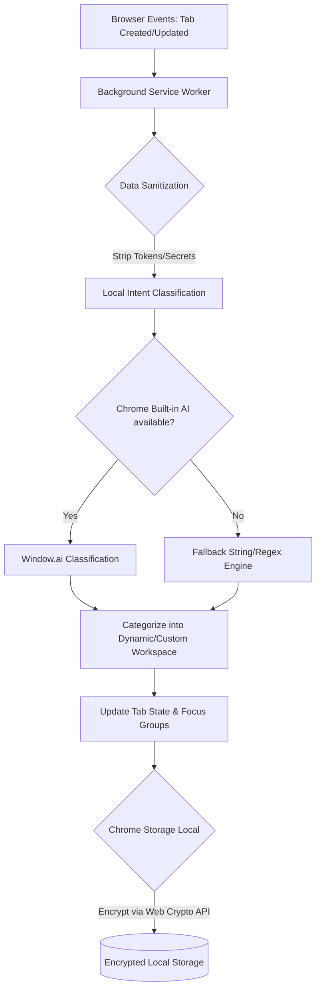

# Tab Orchestrator - Audit Log & Zero-Trust Architecture

## Data Flow Diagram

## Security Measures

### 1. Local-First Processing
- The classification engine natively supports dynamic user workspaces ("Gaming", "Shopping", etc.) without querying an external API. The AI engine processes natural language dynamically natively on-device.

### 2. Data Sanitization
- Prior to processing a URL, parameters matching `.+(secret|token|auth|session|key).+` are excised to ensure absolutely zero risk of sensitive token leakage.
- Title strings are scrubbed for common sensitive identifiers (like UUIDs/hex hashes).

### 3. Encrypted State Management (Storage)
- We use the Web Crypto API (`AES-GCM`). On installation, an AES key is generated and lives purely in isolated active worker memory.
- Any workspace mappings sent to `chrome.storage.local` are fully encrypted. User custom workspaces and theme preferences are tracked dynamically without transmitting payload data.

### 4. Zero Data Persistence Risk
- Analyzed text data is discarded post-classification. No raw URLs are persisted unencrypted. 
- Focus Mode relies on Native Chrome Tab Groups. Toggling Focus Mode OFF destroys the active constraints entirely and restores tabs to unmanaged autonomy safely.

## Permissions Justification

| Permission | Reason |
| --- | --- |
| `tabs` | To read the `url` and `title` properties of open tabs strictly up to the sanitization boundary. |
| `storage` | To locally store encrypted cluster mappings safely between browser restarts. |
| `tabGroups` | To visually manipulate, collapse, and hide irrelevant tabs within the active window (implementing Focus Mode). |
| *NOT Requested* | `webNavigation`, `identity`, wildcards like `<all_urls>` |
